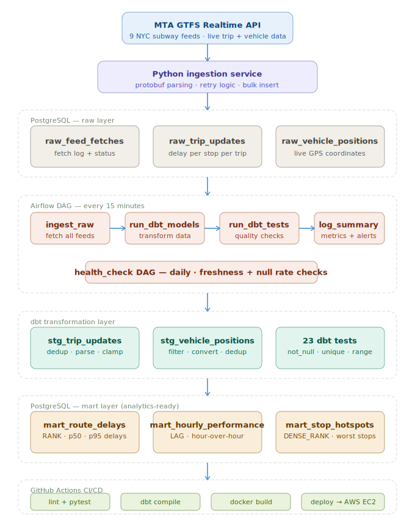

# TransitWatch 🚇

Real-time NYC subway delay analytics pipeline — an end-to-end data engineering project ingesting live MTA GTFS Realtime data, transforming it with dbt, orchestrating with Airflow, and auto-deploying to AWS EC2 via GitHub Actions CI/CD.


---

## Architecture



```
MTA GTFS Realtime API (9 subway feeds)
          │
          ▼
  Python ingestion service
  (protobuf parsing, retry logic)
          │
          ▼
  PostgreSQL — raw layer
  (raw_trip_updates, raw_vehicle_positions)
          │
          ▼
  Airflow DAG (every 15 minutes)
  ├── ingest_raw        → fetch all feeds
  ├── run_dbt_models    → raw → staging → marts
  ├── run_dbt_tests     → data quality checks
  └── log_summary       → pipeline metrics
          │
          ▼
  PostgreSQL — mart layer
  ├── mart_route_delays         (per-route delay rankings)
  ├── mart_hourly_performance   (time-of-day analysis)
  └── mart_stop_hotspots        (worst stations)
```

```
GitHub Push → CI (lint + pytest + dbt + docker build)
Merge to main → Deploy (build images → push ghcr.io → SSH → EC2 restart)
```

---

## Stack

| Layer | Technology |
|---|---|
| Ingestion | Python, requests, gtfs-realtime-bindings, tenacity |
| Orchestration | Apache Airflow 2.9 |
| Transformation | dbt-postgres 1.7 |
| Storage | PostgreSQL 15 |
| Containerisation | Docker, Docker Compose |
| CI/CD | GitHub Actions |
| Cloud | AWS EC2 (t3.small) |
| Registry | GitHub Container Registry (ghcr.io) |

---

## Data model

### Raw layer (append-only, source of truth)
- `raw_feed_fetches` — log of every API call
- `raw_trip_updates` — one row per stop per trip per fetch
- `raw_vehicle_positions` — live GPS positions

### Staging layer (dbt views — cleaned + deduplicated)
- `stg_trip_updates` — deduped via ROW_NUMBER(), delays clamped, dates parsed
- `stg_vehicle_positions` — invalid GPS filtered, unix timestamps converted

### Mart layer (dbt tables — analytics-ready)
- `mart_route_delays` — RANK(), percentile_cont() for p50/p95 delays per route
- `mart_hourly_performance` — LAG() for hour-over-hour delay change
- `mart_stop_hotspots` — DENSE_RANK() for worst stations globally and per route

---

## CI/CD pipeline

Every pull request triggers 4 parallel jobs:
```
lint         → flake8 on ingestion/ and dags/
unit-tests   → pytest (20 tests, no network/DB needed)
dbt-validate → dbt deps + parse + compile against test DB
docker-build → builds ingestion + Airflow images
```

Every merge to main triggers:
```
build-and-push → builds and pushes images to ghcr.io
deploy         → SSH into EC2 → git pull → docker compose up
```

---

## Quickstart (local)

```bash
# 1. Clone
git clone https://github.com/robgotherearly/transitwatch.git
cd transitwatch

# 2. Set up environment
cp .env.example .env
# Edit .env — add your MTA API key (free at https://api.mta.info/)
# Generate Fernet key:
python -c "from cryptography.fernet import Fernet; print(Fernet.generate_key().decode())"

# 3. Start the stack
docker compose up -d --build

# 4. Open Airflow UI
# http://localhost:8081  (admin / admin)

# 5. Run ingestion manually
docker compose run --rm ingestion python fetch_gtfs.py

# 6. Run dbt
docker compose exec airflow-scheduler bash -c "cd /opt/airflow/dbt && dbt run --profiles-dir ."
```

---

## Project layout

```
transitwatch/
├── .github/
│   └── workflows/
│       ├── ci.yml           # PR checks: lint + test + dbt + docker
│       └── deploy.yml       # main: build images + deploy to EC2
├── ingestion/
│   ├── Dockerfile
│   ├── requirements.txt
│   ├── fetch_gtfs.py        # main ingestion script
│   ├── gtfs_parser.py       # protobuf parsing (pure functions)
│   ├── db.py                # database connection helpers
│   └── tests/
│       └── test_gtfs_parser.py   # 20 unit tests
├── dags/
│   ├── transit_pipeline.py  # main DAG (every 15 min)
│   └── health_check.py      # monitoring DAG (daily)
├── dbt/
│   ├── dbt_project.yml
│   ├── profiles.yml
│   ├── packages.yml
│   └── models/
│       ├── staging/         # stg_trip_updates, stg_vehicle_positions
│       └── marts/           # mart_route_delays, mart_hourly_performance, mart_stop_hotspots
├── docker-compose.yml
├── Dockerfile.airflow       # custom Airflow image with dbt
├── init_db.sql              # raw + staging + mart schema
└── .env.example             # environment template
```

---

## Sample analytics queries

```sql
-- Most delayed subway routes right now
SELECT route_id, avg_delay_s, p95_delay_s, delay_rate_pct, delay_rank
FROM public_marts.mart_route_delays
ORDER BY delay_rank;

-- Worst stations today
SELECT stop_id, route_id, avg_delay_s, global_delay_rank
FROM public_marts.mart_stop_hotspots
ORDER BY global_delay_rank
LIMIT 10;

-- Rush hour vs off-peak delays
SELECT hour_of_day, avg_delay_s, worst_route_id, delay_change_s
FROM public_marts.mart_hourly_performance
ORDER BY hour_of_day;
```

---

## Development workflow

```bash
# Create a feature branch
git checkout -b feature/your-feature

# Make changes, then run tests locally
docker compose run --rm ingestion pytest tests/ -v
docker compose exec airflow-scheduler bash -c "cd /opt/airflow/dbt && dbt test --profiles-dir ."

# Push and open a PR — CI runs automatically
git push origin feature/your-feature

# Merge to main → auto-deploys to EC2
```

---

## Environment variables

| Variable | Description |
|---|---|
| `POSTGRES_USER` | Database user |
| `POSTGRES_PASSWORD` | Database password |
| `POSTGRES_DB` | Database name |
| `MTA_API_KEY` | Free MTA API key (https://api.mta.info/) |
| `AIRFLOW__CORE__FERNET_KEY` | Airflow encryption key |
| `AIRFLOW__WEBSERVER__SECRET_KEY` | Airflow web secret |
| `GTFS_FEED_NAME` | Feed identifier (e.g. nyc_mta) |
